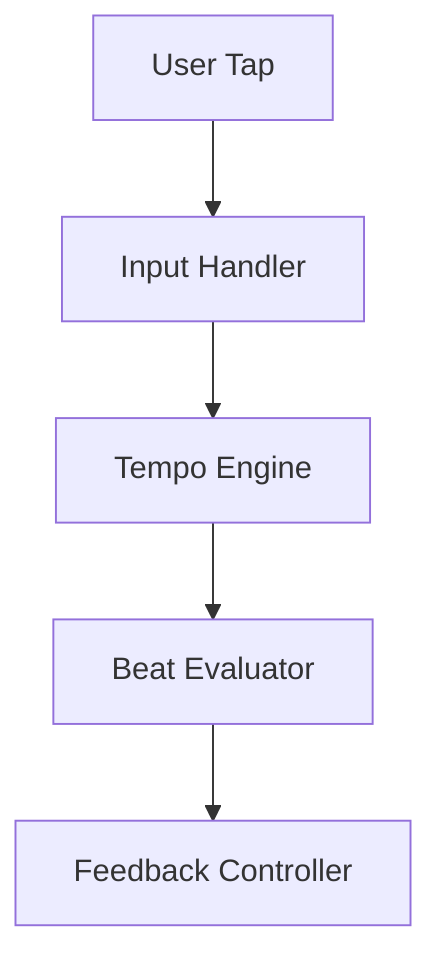
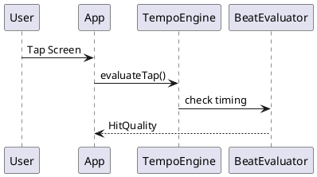
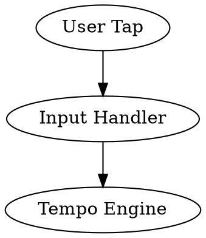
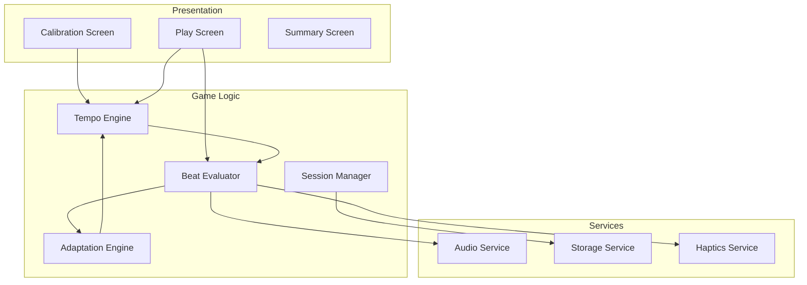

# Diagrams
## Micro-Velocity Technical Diagrams

This directory contains technical diagrams for system architecture, data flow, and timing logic.

## Planned Diagrams

### 1. System Architecture (`system-architecture.png`)

**Purpose**: Visualize the complete component structure

**Content**:
```
┌─────────────────────────────────────────┐
│         React Native App                │
├─────────────────────────────────────────┤
│  Presentation Layer                     │
│  - Screens (Calibration, Play, Summary)│
│  - Components (BeatIndicator, etc)     │
├─────────────────────────────────────────┤
│  Game Logic Layer                       │
│  - TempoEngine                          │
│  - BeatEvaluator                        │
│  - AdaptationEngine                     │
│  - SessionManager                       │
├─────────────────────────────────────────┤
│  Services Layer                         │
│  - AudioService                         │
│  - StorageService                       │
│  - HapticsService                       │
├─────────────────────────────────────────┤
│  Core Services                          │
│  - Timer (performance.now())            │
│  - Event Bus                            │
│  - Config Manager                       │
└─────────────────────────────────────────┘
```

### 2. Data Flow (`data-flow.png`)

**Purpose**: Show how data flows through the app during gameplay

**Key Flows**:
```
User Tap → InputHandler → TempoEngine.evaluateTap()
         → BeatEvaluator → HitQuality
         → FeedbackController → Visual/Audio/Haptic Feedback
         → PerformanceTracker → Update Metrics
         → AdaptationEngine → Adjust BPM (if needed)
```

### 3. Beat Evaluation Timing (`beat-timing.png`)

**Purpose**: Visualize the timing windows and evaluation logic

**Content**:
```
Timeline view showing:
- Perfect window (±50ms)
- Good window (±100ms)
- Miss threshold (>100ms)
- Example tap placements
- Beat pulse visualization
```

### 4. Session Lifecycle (`session-lifecycle.png`)

**Purpose**: State machine for session flow

**States**:
```
[Start] → [Calibration]
          ↓
       [Tutorial (optional)]
          ↓
       [Playing] ⇄ [Paused (future)]
          ↓
       [Summary]
          ↓
       [Start] or [Exit]
```

### 5. Calibration Algorithm (`calibration-algorithm.png`)

**Purpose**: Flow chart for BPM detection

**Steps**:
```
1. Collect tap timestamps (10 taps)
2. Calculate intervals between taps
3. Filter outliers (< 300ms or > 2000ms)
4. Sort and find median interval
5. Convert to BPM (60000 / median)
6. Clamp to range (60-140 BPM)
7. Return BPM + confidence level
```

## Diagram Specifications

**Format**: PNG or SVG (SVG preferred for scalability)
**Tools**: Any diagramming tool or code-based generation
**Style**: Clean, modern, matching brand colors (cyan/navy theme)

## Tools for Creating Diagrams

### Code-Based (Recommended)

**Mermaid.js** (Markdown-like syntax):


**PlantUML** (Text-based UML):


**Graphviz/DOT**:


### Visual Tools

- **draw.io** (https://draw.io) - Free, web-based
- **Lucidchart** - Professional diagrams
- **Excalidraw** (https://excalidraw.com) - Hand-drawn style
- **Figma** - Can also create diagrams

### Command Line

**Mermaid CLI**:
```bash
npm install -g @mermaid-js/mermaid-cli
mmdc -i diagram.mmd -o diagram.png
```

## How to Generate Diagrams

### Example: System Architecture with Mermaid

Create `system-architecture.mmd`:


Generate PNG:
```bash
mmdc -i system-architecture.mmd -o system-architecture.png -t dark -b transparent
```

### Example: Timing Windows

Create visual representation of ±50ms/±100ms windows:
```
Beat Time: 1000ms

   900     950    1000   1050   1100
    |-------|------|------|------|
    [  GOOD |PERFECT|GOOD  ]
            <--50ms->
    <------100ms-------->

    < 900ms or > 1100ms = MISS
```

## Naming Convention

```
[diagram-type]-[variation].png

Examples:
system-architecture.png
system-architecture-detailed.png
data-flow.png
data-flow-calibration.png
beat-timing.png
session-lifecycle.png
```

## Color Scheme for Diagrams

Match brand colors:
- Background: #1a1a2e (dark navy)
- Primary elements: #00d4ff (cyan)
- Secondary: #00fff5 (light cyan)
- Accent: #ffb347 (amber)
- Text: #e8f4f8 (off-white)
- Borders: #2a3f52 (dark blue-gray)

## Status

- [ ] System architecture diagram
- [ ] Data flow diagram
- [ ] Beat evaluation timing diagram
- [ ] Session lifecycle diagram
- [ ] Calibration algorithm flowchart

## Next Steps

1. Choose diagramming approach (Mermaid recommended)
2. Create each diagram systematically
3. Save to this directory
4. Reference in architecture.md
5. Update as implementation evolves

---

**Note**: Diagrams will be created and added to this directory during the specification and implementation phases.
